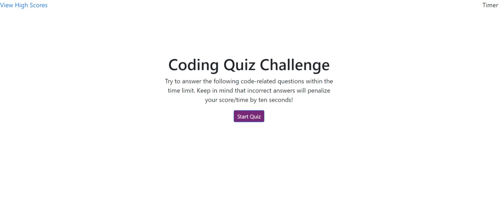

# 04 Web APIs: Code Quiz

## Your Task

At some point in your journey to become a full-stack web developer, you’ll likely be asked to complete a coding assessment&mdash;perhaps as part of an interview process. A typical coding assessment includes both multiple-choice questions and interactive coding challenges. 

To help familiarize you with these tests and allow you to use the skills covered in this unit, this week’s homework invites you to build a timed coding quiz with multiple-choice questions. This app will run in the browser and will feature dynamically updated HTML and CSS powered by JavaScript code that you write. It will have a clean, polished, and responsive user interface. 

This week’s coursework will equip you with all the skills you need to succeed in this assignment.

## Mock-Up

The following animation demonstrates the application functionality:

 (./assets/web2.jpeg)

### Deployment: 

* Application deployed at live URL.

[Click here to go to deployed application.](https://behnoosh93.github.io/Quiz/.)

* Application GitHub URL submitted.

[Click here to go to deployed application.](https://github.com/Behnoosh93/Quiz)

